# Creador de portafolios

Este es un proyecto web simple que te permite registrar, actualizar, buscar, eliminar y  renderizar portafolios por medio de la información que se introduce en un formulario. 
Además guardarlas en tu propia base de datos con json-server.

## Características

- Registrar un perfil por medio de un formulario.
- Editar el perfil registrado.
- Eliminar el perfil registrado.
- Buscar un perfil específico por medio de la cédula registrada.
- Generar un portafolio con la información registrada.

## Capturas de Pantalla

- Página principal.
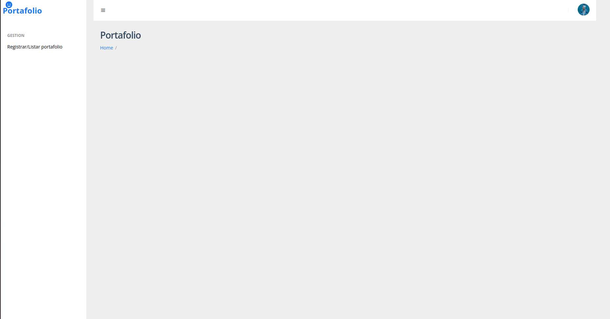
- Formulario.
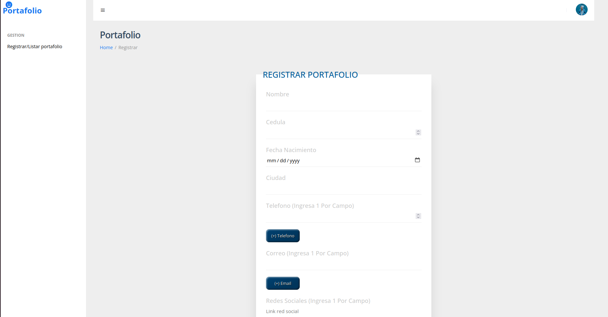
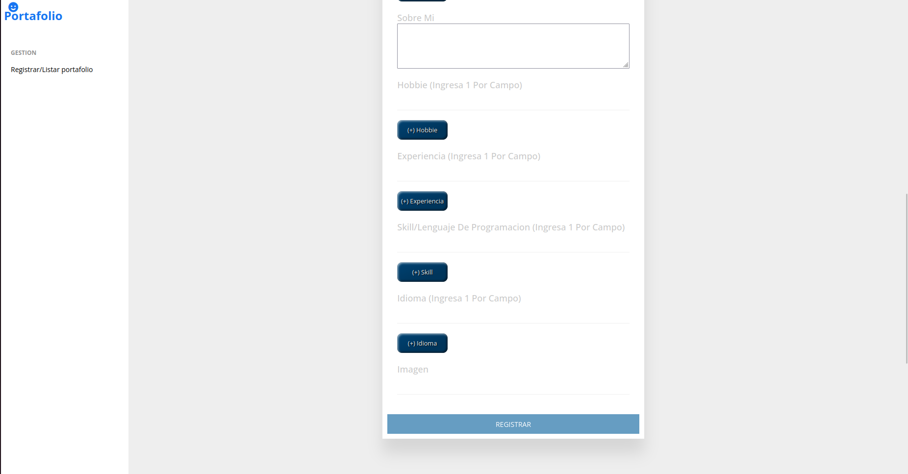
- Tabla de registros.
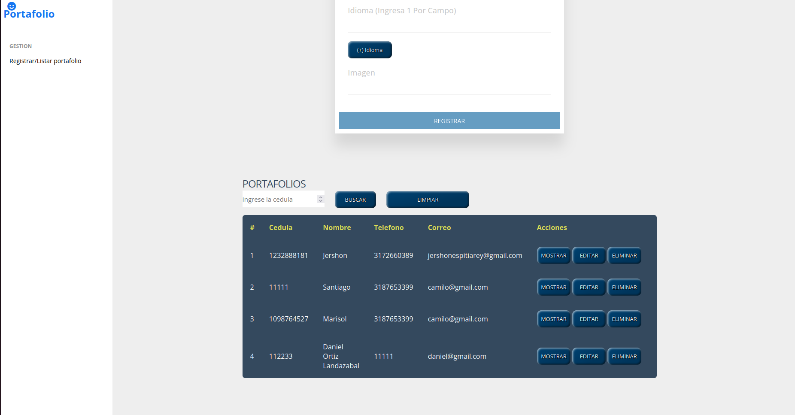
- Portafolio generado.
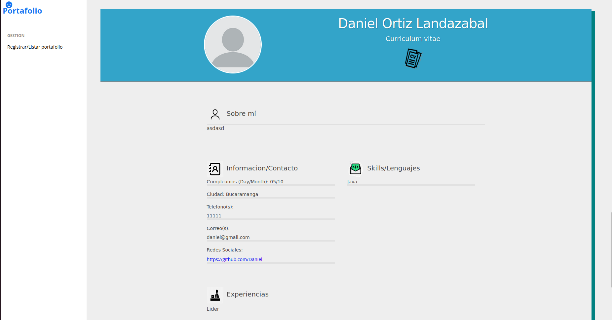

## Tecnologías Utilizadas

- HTML5
- CSS3
- JavaScript
- [Node](https://nodejs.org/es)

## Base de datos

http://127.0.0.1:5070/profiles

Nota: Para buscar un perfil específico registrado en la base de datos, se debe agregar el id al final de la url, el id es asignado en orden ascendente.

Ejemplo: http://127.0.0.1:5070/profiles/1

En caso de no mostrar nada, es posible que el ID no exista.

#

# Estructura del proyecto

- database
    * db.json
- imgs
    * imagenPortada
    * ss1.png
    * ss2.png
    * ss3.png
    * ss4.png
    * ss5.png
- storage
    * config.js
    * methods.js
    * profile.js
    * validations.js
- .gitignore
- app.js
- index.html
- main.js
- package-lock.json
- package.json
- README.md
- style.css

# Uso

NOTA: Para poder ejecutar el proyecto, debemos instalar algunas cosas primero en caso de no tenerlas:
1. Descargar la version 18.18.0 (https://nodejs.org/en)
2. Ejecutar el archivo descargado

Luego de tener instalado lo anterior:

1. Clona este repositorio en tu máquina local con el siguiente comando: `git clone https://github.com/JershonEspitia/ProjectPortfolio.git`

2. Abre la terminal y ejecuta el comando `npm i`

3. Ejecuta en la terminal `npm run dev` para arrancar el servidor

4. Abre el archivo `index.html` en tu navegador web para ejecutar la aplicación

5. Utiliza la aplicación para registrar información mediante el formulario.

6. Realiza acciones a cada registro mediante los botones de cada perfil en la tabla.

#

# Como funciona la pagina

1. Al abrir el archivo `index.html` encontraremos nuestra pagina asi:
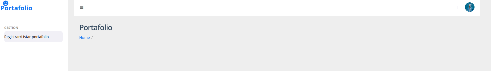
En esta parte lo que debemos hacer es dar click en el boton `Registrar/Listar portafolio` para poder ver el formulario.

2. Luego de darle click al boton, veremos nuestro formulario asi:
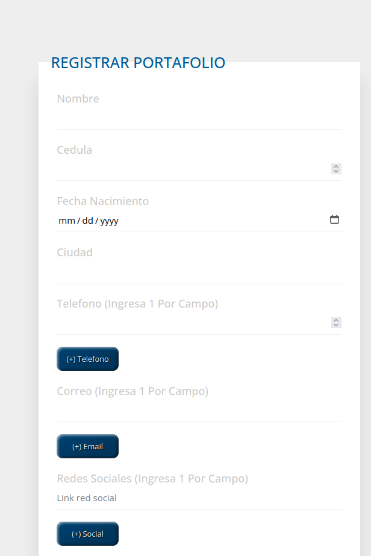
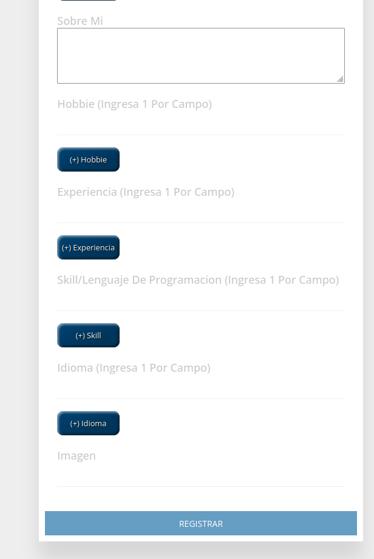
Aca debemos ingresar nuestra informacion, para que al final dando click en el boton `REGISTRAR` guardemos nuestro perfil en la base de datos.
Tambien podemos agregar mas campos en los botones [(+) Boton].

3. Debajo del formulario encontramos la tabla de registros.
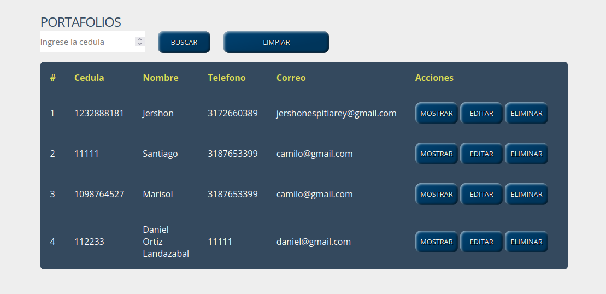
Aca encontramos informacion principal de cada registro realizado.
Ademas encontramos 3 botones de acciones que nos permiten, eliminar, editar y mostrar.

4. Si damos click en el boton de `EDITAR`, el formulario cargara la informacion que fue registrada inicialmente, y nos permitira editarla.
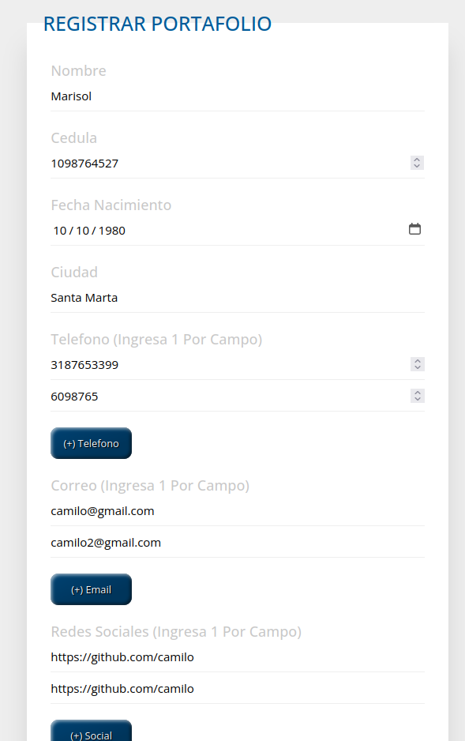

5. Y por ultimo si damos click en el boton de `MOSTRAR` se generara un portafolio del perfil
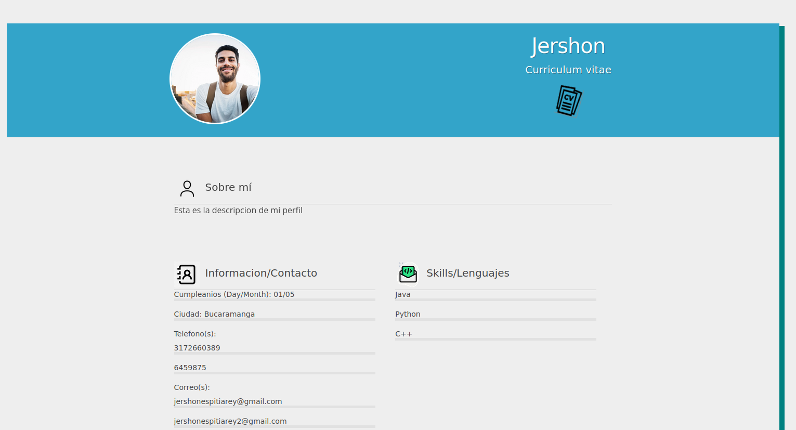

# Contribución

¡Las contribuciones son bienvenidas! Si tienes ideas de mejoras o correcciones, no dudes en crear una solicitud de extracción (pull request) o informar sobre problemas (issues).

#

# Contacto
Si tienes alguna pregunta o comentario, no dudes en ponerte en contacto con el equipo de desarrollo.

# Autor

[By @JershonEspitia](https://github.com/JershonEspitia)